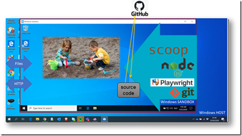
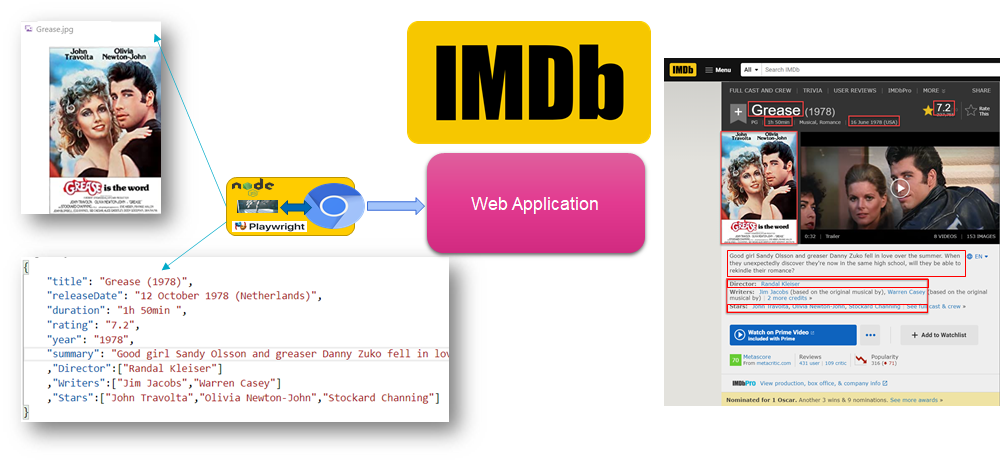
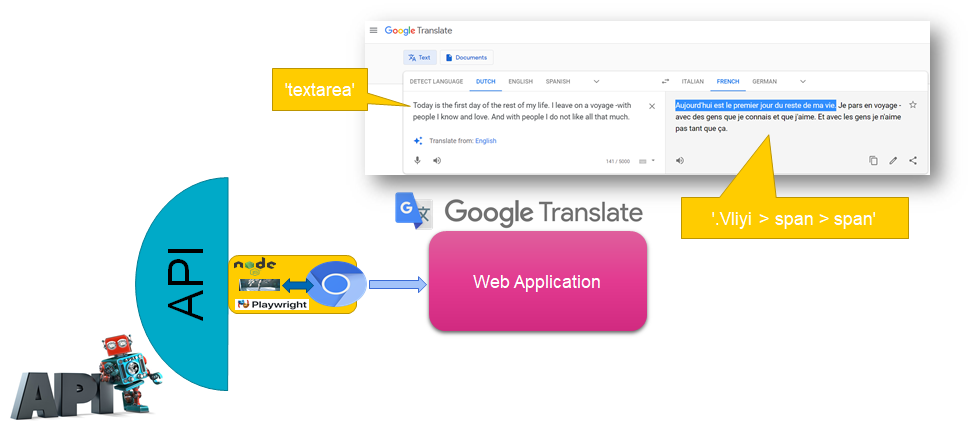
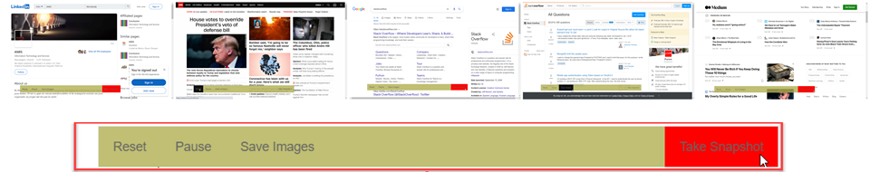
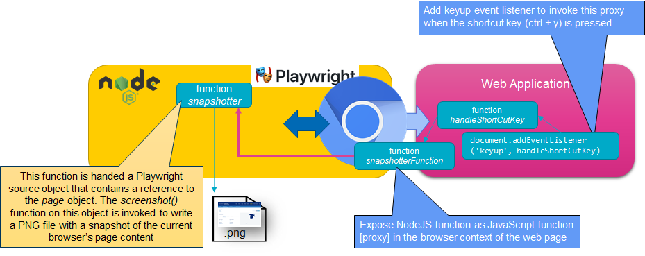
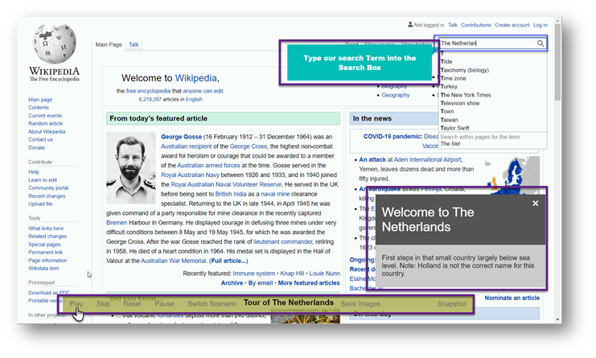
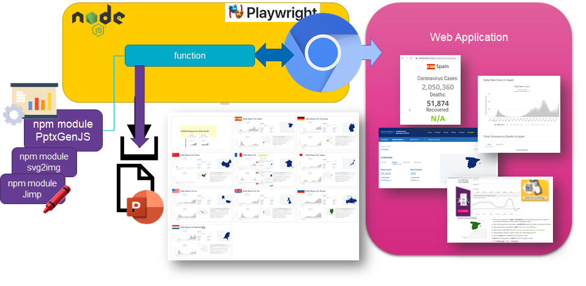
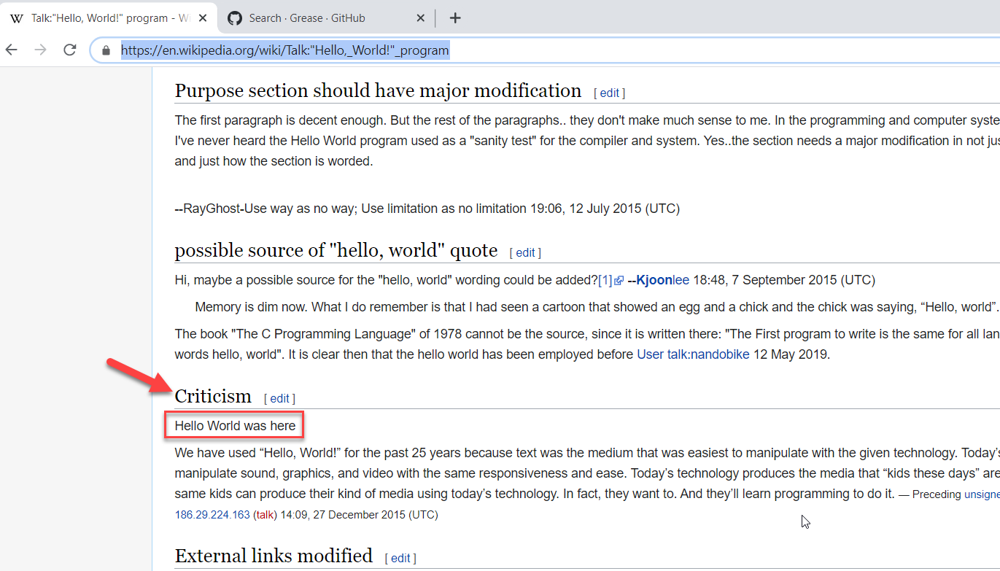
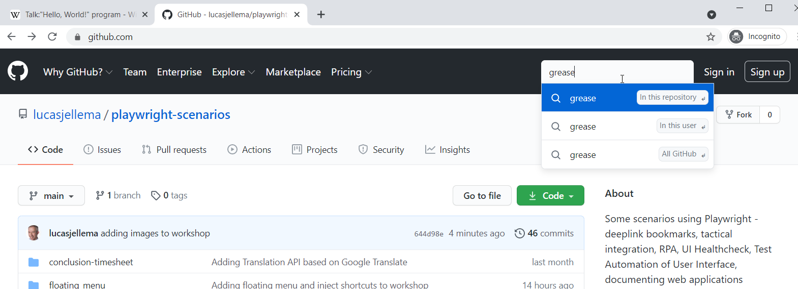
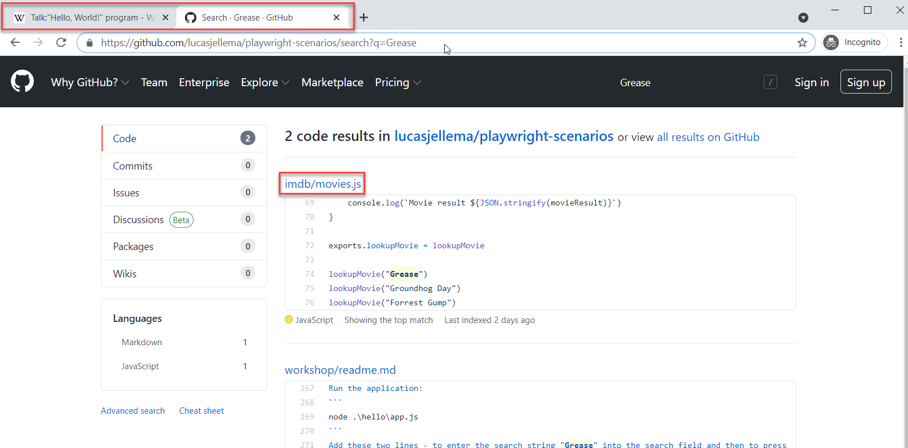

# Playwright workshop - Hands On Instructions

This document suggests steps to get started with Playwright. It describes steps to install Playwright, to run a number of demonstrations and to get going with your own applications leveraging Playwright.

1. Installation
2. Running (and inspecting and tweaking) the demonstrations
3. DIY: creating your own Hello World application with Playwright

## 1. Installation

You can work with Playwright in various environments. For headful scenarios, you need to be able to display a graphical (desktop) UI. Working on Windows, MacOS or a Linux Desktop is recommended. You can go through this workshop in your regular Node development environment or (when on Windows) use a Windows Sandbox (an isolated, clean environment).

### Run in Local Environment
In order to run the scenarios in a local environment, you only need a recent Node runtime environment including npm.

Install all workshop resources:
```git clone https://github.com/lucasjellema/playwright-scenarios```

Navigate into the root directory `playwright-scenarios` for the repository created locally by this clone operation

Next install the NPM module Playwright:

```npm i playwright```

This installs Playwright and browser binaries for Chromium, Firefox and WebKit. See [Playwright on NPM site](https://www.npmjs.com/package/playwright) for details on the npm module.

### Run in isolated Windows Sandbox
To explore these scenarios on Windows, you can work most easily in a Windows Sandbox (see [this article](https://technology.amis.nl/frontend-technology/quickly-run-nodejs-demos-in-vanilla-windows-sandbox-featuring-scoop/) for detailed instructions and step by step picture).


#### Quick Instructions for running in Windows Sandbox

Start Windows Sandbox.
Open Command Line as Administrator.
Execute `notepad script.ps1`
Confirm that notepad should create the file
Paste this snippet to the the file script.ps1:
```
Invoke-Expression (New-Object System.Net.WebClient).DownloadString('https://get.scoop.sh')

# Note: if you get an error you might need to change the execution policy (i.e. enable Powershell) with
# Set-ExecutionPolicy RemoteSigned -scope CurrentUser

# this one line is all it takes to install a git client and the latest nodejs runtime environment 
scoop install git nodejs 
# these two lines install a distribution of VS Code (this is optional and these lines can be removed to save time)
scoop bucket add extras 
scoop install vscodium

node --version
```
Save and close the file.

Execute this command - which basically runs the file `script.ps1` that you have just created:
```
%SystemRoot%\System32\WindowsPowerShell\v1.0\powershell.exe -NoProfile -InputFormat None -ExecutionPolicy Bypass -Command ".\script.ps1"
```
This will install Scoop into the Sandbox and subsequently use Scoop to install a Git client and the Node runtime.

Close the command line (window). Then open a new command line - either as Admin or not.

Paste the following lines:
```
git clone https://github.com/lucasjellema/playwright-scenarios
cd playwright-scenarios
npm install -D playwright
node .\step-by-step\step-by-step.js
```
The last step runs a demonstration that shows a Wikipedia tutorial with three scenarios for Netherlands, France and UK. Please maximize the Windows Sandbox window as well as the browser window.


## 2. Run Prebuilt Demonstrations of the Power of Playwright
Each of the demo scenarios can be ran from the command line, from the root directory `playwright-scenarios` of the cloned GitHub repo. Most are headful, some are headless.
    
### Quick Demos: Navigate, Click, Read, Generate Screenshot, MP4 and PDF

There are a few very small, simple and quick demos you can run to get going.

For example, run:
```node quick-demos\get-started.js```
This runs a Chromium browser, navigates to website *http://whatsmyuseragent.org/*, retrieves the IP address of your laptop and takes a screenshot (saving it as *example.png*). You can change *chromium* to *firefox* (twice) in file *get-started.js* and run the program again. This time, a Firefox browser is started - and the same actions are performed.

Now run 
```node quick-demos\page.js```

This demo opens a page ("http://example.com"), then clicks on the first link it can find on this page which causes a navigation to take place. The URL of the new page is written to the console. A second page (i.e. browser tab) is opened. This page navigates to the GitHub Repo for this workshop. Finally, the button labeled *main* is clicked and the dropdown for selecting branches or tags is opened. Note: the call to *chromium* contains parameter *sloMo*, set to 3000. This is the number of miliseconds added by Playwright between each action it takes. This is a useful feature for debugging the actions our program is taking. When the scenario is done, we can remove the parameter or set it to a very low value. You may want to try this right now.

To see how Playwright can also take a video of the action it takes, run
```
node quick-demos\generateVideo.js
```
An MP4 file is generated in folder *quick-demos\video* which shows exactly what was seen in the browser as the scenario was executed. Note that you do not need to run in headful mode in order to generate the video. A video is especially useful in case the scenario fails.

Somewhat similarly, Playwright can also generate a PDF file that contains the full content of a web page. Run
```node quick-demos\generatePDF.js```
This will take a quick tour of the CNN website and generate the file *cnn.pdf*. Note: generating PDF documents currently only works with the Chromium browser and when running in *headless* mode.


### Scraping Movie data from the IMDb Web Site
Folder imdb contains a Node application `movie.js`. Using Playwright, this application opens the IMDb web site and searches for a movie by title. It scrapes the IMDb page for movie properties and returns a JSON object with these attributes such as director, actors, writers, release date, duration. It also writes a JPG file with the movie poster. 


Run
```node .\imdb\movies.js```
to get a JSON document on the command line with details about three movies. In the directory imdb/images, you will find the movie posters for these movies. Add calls to *lookupMovie()* in order to scrape IMDb for additional movies.


### Turning Google Translate UI into an API
Folder Translate contains a Node appplication `translate.js` that interacts through Playwright with Google Translate.


You can run this application with
```node translate\translate.js```

You will get the translation into French of the sentence *De boodschappen voor vandaag zijn melk, boter en eieren. Neem ook een stuk kaas mee. En ik lust ook een pot met stroop.* (this is Dutch). You can change the target language and the source text and language by editing the call to function *doTranslation()* at line 41 of this file.

Node application `translate-api.js` uses the function exported by `translate.js` to implement an API. If you run `translate-api.js`, an HTTP listener is started that will process HTTP requests, use translate.js and indirectly Google Translate for making the desired translation and returns the translated text. At present it is restricted to texts of 5000 characters, but it could fairly easily be extended by making multiple - possibly parallel - calls to Google Translate.

```node  .\translate\translate-api``` 

– this runs a REST API at port 3000 listening for HTTP requests such as `http://localhost:3000/?sourceLanguage=nl&targetLanguage=fr&sourceText=Goedendag` ; This API leverages the Google Translate Web UI to perform a translation.


### Floating Menu in any Web Page or App
Shows how a floating toolbar can be injected into virtually any web application. [This article](https://technology.amis.nl/frontend-technology/inject-generic-floating-toolbar-into-any-web-application-or-site-using-playwright/) provides background on this scenario.


Run this command:

```
node .\floating_menu\floating-menu.js
```
This will load the site medium.com in the Chromium browser. The floating toolbar is injected into the page. The toolbar has two active options:
* Take Snapshot - save a PGN image for the current contents shown in the browser viewport. Note: the toolbar is hidden prior to taking the snapshot to the local file system's floating-menu\snapshots directory
* Save All Images - save all IMG elements in the current web page to the local file system's floating-menu\images directory

Try to the two functions in the floating menu bar. Navigate to a different web page. Check if the toolbar is injected again.

The definition of the toolbar is defined in *const navBar* , supported by the CSS definition in *const menuStyleTag*. Feel free to tinker with the both, and see the effect. 

### Power User Shortcut Key Injection into Any Web Page or Application
To show how a shortcut key combination can be injected into almost any page. This demo shows the shortcut key combination to download all images in a web page to local files. See [this article for details](https://technology.amis.nl/tech/use-playwright-to-inject-shortcut-keys-into-any-web-page-for-example-to-download-all-images/) 



```
node .\inject-shortcuts\inject-shortcut-download-all-images.js
```

This program opens a browser and navigates to a web site. It activates three shortcuts:
* ctrl + y - take snapshot of current browser viewport (save as PNG)
* ctrl + b - download all images in the current page - save locally as images files
* ctrl + m - save the image currently under the mouse pointer - save locally as image file (note: this currently only works when the image under the mouse is an IMG element; not when the image is loaded through CSS or when the image is wrapped in a DIV or SPAN or defined as SVG)

Move the mouse over an image and press CTRL+m. The image under the mouse pointer will be saved to the local file system. Use CTRL+y to create a snapshot of the page as visible in the browser viewport.


### Live Web Site Step by Step Demo | Tutorial
Run demonstrations or instructions of browser actions. Allow the user to pause and skip acts, and to reset and switch scenarios. Allow the user to interact with the browser before, after and during the scenarios. This demonstration shows three scenarios (The Netherlands, France, UK). Each country is introduced – using specific pages and sections on Wikipedia as well as through supporting sites. A callout is used to explain the scenario and each act. Balloon texts are used to further guide the user,

This article introduces the demo in detail:[Run Automated Step-by-Step Browser Scenarios for Instruction or Demo from NodeJS applications with Playwright](https://technology.amis.nl/frontend-technology/run-automated-step-by-step-browser-scenarios-for-instruction-or-demo-from-nodejs-applications-with-playwright/)


Run with
```node .\step-by-step\step-by-step.js```

### Powerpoint Generator with Images, Snapshots and Data from various Web Sites
Playwright can gather information from many different websites. Navigating to a site, taking a screenshot, downloading an image, creating an image from an SVG object and using that content to produce a Powerpoint presentation (using the npm module *PptxGenJS*) is fairly straightforward, as this demo shows.


Run with 
```
node .\slideshow\generateCOVID19-report.js
```
Check the generated Powerpoint presentation in directory *slideshow*; see how the slide notes on the country report pages indicate the URLs for the source pages. 

To get a different set of country reported in the slideshow, edit file *generateCOVID19-report.js* and change the content of *const countries*. 

## 3. DIY Hello World - Playwright by you
And now you create a simple first Playwright infused program. One that will instantiate a browser, open a page, navigate to a site and perform a single simple action. And then build from there.

The steps are:
1. create a new directory *hello*
2. create a new file called *app.js*
3. add the following content to the file:

```
const { chromium } = require('playwright');
const assert = require('assert');

(async () => {
  const browser = await chromium.launch({headless: false});
  const page = await browser.newPage();
  await page.goto('https://en.wikipedia.org/wiki/%22Hello,_World!%22_program');

  await browser.close();
})();
```
Run your first Playwright Application:
```
node .\hello\app.js
```
You should see the browser being launched, the page being created and navigated. And the browser being closed immediately after that. No lingering around. To take things slower, you can add the *sloMo* property in the instantiation of the browser:
```
await chromium.launch({ headless: false , slowMo:3000})
```
or remove the line that closes the browser.

Add the following snippet between the lines with page.goto() and browser.close():
```
  await page.click('a[title="Discuss improvements to the content page [alt-shift-t]"]')
  const criticismHeader = await page.$('#Criticism')
  await criticismHeader.scrollIntoViewIfNeeded()
  // get a handle on the text paragraph following the header 
  const criticism = await page.$('p:text("Few criticism")')
  // get the text content of this P element
  const criticismContent = await criticism.textContent()
  console.log(`Content of first paragraph: ${criticismContent}`)
```
This navigates to the second tab and scrolls down to the paragraph labeled *Criticism*. The text content of the next paragraph (a P element) is retrieved and written to the console (in the Node context).

Run the application to see this in action:
```
node .\hello\app.js
```

Extend the snippet with these lines:
```
  // set the textContent of the paragraph; note: the console.log() in this snippet
  // is executed in the Browser context - not in the NodeJS context
  await page.evaluateHandle(p => {console.log(`setting innerText from current ${p.innerText}`); p.innerText = "Hello World was here"}, criticism);
```
This changes the text content by direct manipulation of the DOM element using the *page.evaluateHandle()* function, to demonstrate how we easily go from the Node context into the browser context, taking the Playwright element handle with us to pinpoint the correct DOM element. At this point we can read and manipulate the element and its siblings, children and ancestors. We can invoke JavaScript in the browser context and return data to the NodeJS context of our program.


To see this in action, run the application:
```
node .\hello\app.js
```

### Open a second browser (tab)

Add the lines:
```
  const githubPage = await browser.newPage();
  await githubPage.goto('https://github.com/lucasjellema/playwright-scenarios');   
```
and run `node app.js` again. A second browser window is opened with GitHub loaded, parallel to the original one with Wikipedia. 

If you want to open a second browser tab, you would need to create all page from the same browser context; replace the line:
```
  const page = await browser.newPage();
```
with:
```
  const context = await browser.newContext()
  const page = await context.newPage();
```
and use 
```
  const githubPage = await context.newPage();
```
instead of
```
  const githubPage = await browser.newPage();
```
This will create both pages as tabs in the same browser context (sharing the same locale, geolocation and device settings).

Run the application:
```
node .\hello\app.js
```
Add these two lines - to enter the search string "Grease" into the search field and then to press Enter in order to execute the search and show the (one) source file that contains the string *Grease*:


```
  await githubPage.fill('input[name=q]',"Grease")
  await githubPage.press('input[name=q]','Enter')
```

Let's make a very basic start with testing the web page. Add these lines to the *app.js* file:

```
  await githubPage.waitForSelector('"imdb/movies.js"')
  const searchResult = await githubPage.$('"imdb/movies.js"')  
  assert (searchResult)
  
  // retrieve the title attribute of the searchResult element (handle) - an anchor element
  const title = await searchResult.getAttribute('title')
  console.log(title)
  assert (title =="imdb/movies.js")
```
This in all honesty is not the best example of a test. It is useful to see the mechanics though. Get an element handle and test whether its attributes have the expected values. And of course verify that element handle exists to begin with.

A typical End to End test would try out more complex scenarios and could also verify the results from executing those steps directly in backend systems, through APIs and in secondary browser tabs or windows to inspect the effect in an isolated context.

### Complete code in app.js
The complete code as this point in file *app.js* should look like this:
```
const { chromium } = require('playwright');
const assert = require('assert');

(async () => {
  const browser = await chromium.launch({headless: false, slowMo:400});
  const context = await browser.newContext()
  const page = await context.newPage();
  await page.goto('https://en.wikipedia.org/wiki/%22Hello,_World!%22_program');
  await page.click('a[title="Discuss improvements to the content page [alt-shift-t]"]')
  const criticismheading = await page.$('#Criticism')
  await criticismheading.scrollIntoViewIfNeeded()
  const criticism = await page.$('p:text("Few criticism")')
  const criticismContent = await criticism.textContent()
  console.log(`Content of first paragraph: ${criticismContent}`)
  await page.evaluateHandle(p => {console.log(`setting innerText from current ${p.innerText}`);p.innerText = "Hello World was here"}, criticism);
  // open a second browser
  const githubPage = await page.context().newPage();
  await githubPage.goto('https://github.com/lucasjellema/playwright-scenarios');
  await githubPage.fill('input[name=q]',"Grease")
  await githubPage.press('input[name=q]','Enter')
  await githubPage.waitForSelector('"imdb/movies.js"')
  const searchResult = await githubPage.$('"imdb/movies.js"')
  
  assert (searchResult)

  const title = await searchResult.getAttribute('title')
  console.log(title)
  assert (title =="imdb/movies.js")
 // await browser.close();
})();
```